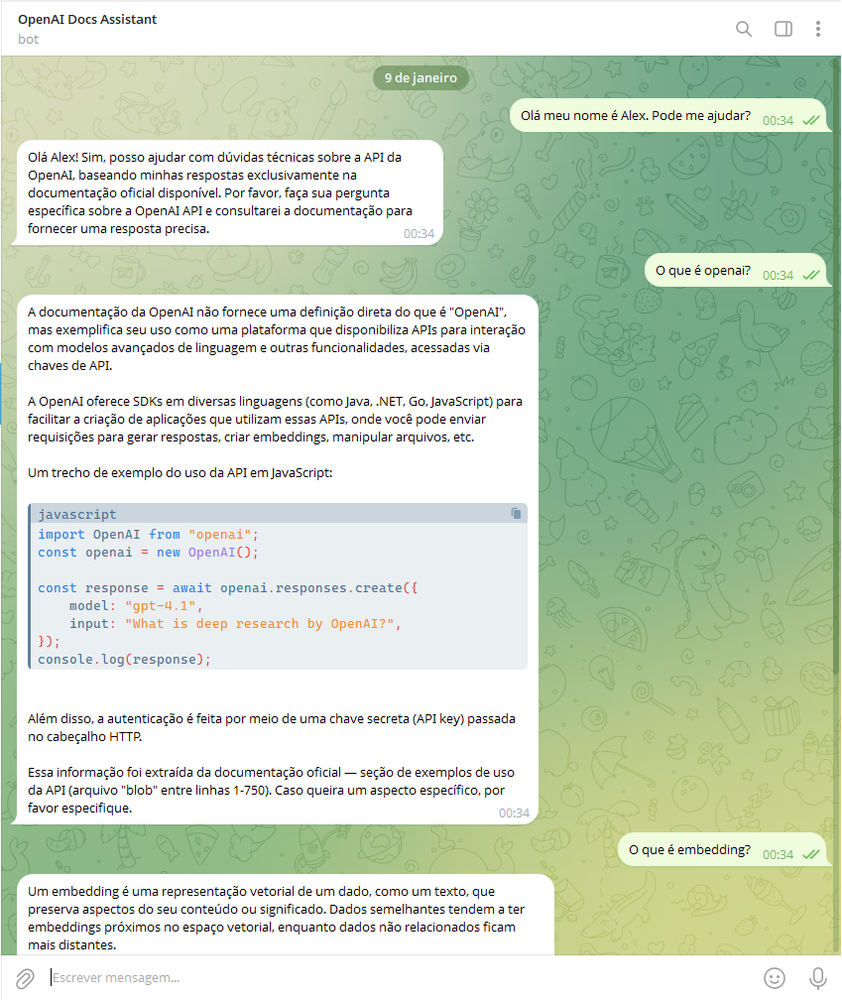
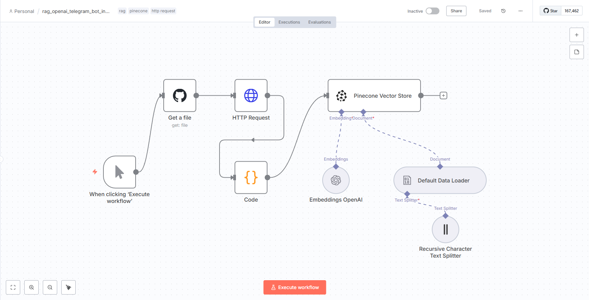
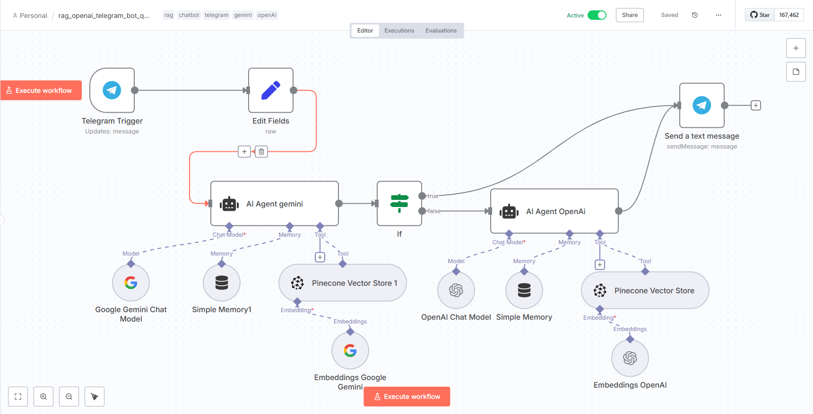

## n8n RAG Telegram Bot – Assistente de Documentação da OpenAI

Projeto de chatbot assistente com RAG para consulta à documentação da API OpenAI, utilizando n8n e banco vetorial.

Um chatbot inteligente construído no **n8n**, que integra **Telegram**, **AI Agents** e **retrieval-augmented generation (RAG)** utilizando **Pinecone Vector Store**.  
O bot responde dúvidas sobre a **documentação oficial da API da OpenAI**, garantindo respostas precisas, contextualizadas e baseadas apenas no conteúdo oficial.

---

## ⚡ Funcionalidades Principais

- **Consulta baseada em RAG**  
  - Recupera informações diretamente de arquivos `.md` da documentação da OpenAI honspedada no Github.
  - Usa embeddings para busca semântica no **Pinecone Vector Store**.
  
- **AI Agents integrados**
  - Prioritariamente utiliza  AI agente com **Gemini AI** sem custos;
  - Fallback automático alterna para o segundo AI Agente com **OpenAI** para quando o acesso gratuito da Gemini expirar o fluxo alterna para o modelo da OpenAi pago.
  
- **Telegram Bot**



  - Recebe perguntas em tempo real.
  - Retorna respostas contextualizadas diretamente no chat.
  - Mantém histórico por usuário utilizando `Session ID` para memória opcional.

- **Workflow profissional**
  - **Workflow 1 – Ingestão**: carrega os arquivos do GitHub, faz chunking, gera embeddings e armazena no Pinecone.
  - **Workflow 2 – Query & Resposta**: recebe perguntas via Telegram, consulta o Pinecone, usa AI Agent (Gemini/OpenAI) e retorna a resposta ao usuário.

---

## 📂 Estrutura do Projeto
```text
n8n-rag-openai-docs-assistant/
│
├─ assets/
│ ├─ workflow_ingest.png
│ ├─ workflow_query.png
│
├─ workflows/
│ ├─ rag_openai_telegram_bot_ingestion # Workflow de ingestão
│ └─ rag_openai_telegram_bot_query # Workflow de perguntas e respostas
│
├─ docs/
│ └─ openai_api/
│ ├─ APIerrors.md
│ ├─ RateLimits.md
│ ├─ Pricing.md
│ └─ ... (outros arquivos da documentação)
│
└─ README.md

```
---

## ⚙️ Tecnologias e Ferramentas

| Ferramenta | Função no projeto |
|------------|-----------------|
| **n8n** | Automação de workflows, integração de nodes e execução lógica |
| **Telegram Bot API** | Interface com usuário para perguntas e respostas |
| **OpenAI API / Gemini AI** | Geração de respostas baseadas em RAG |
| **Pinecone Vector Store** | Armazenamento e recuperação de embeddings |
| **GitHub** | Hospedagem dos arquivos `.md` da documentação oficial |
| **Python / Code Node** | Chunking customizado e manipulação de dados, quando necessário |

---

## 📝 Workflow Detalhado

### 1️⃣ Workflow de Ingestão



- **Objetivo:** converter documentação da OpenAI em chunks semânticos e armazenar no Pinecone.
- **Etapas:**
1. Ler arquivos `.md` do repositório GitHub.
2. Aplicar **chunking customizado** (1000 caracteres por chunk com 200 de overlap).
3. Gerar embeddings usando **OpenAI Embeddings** (ou outro provider compatível, ex: Gemini).
4. Armazenar chunks e metadados no **Pinecone Vector Store**.

- **Benefício:** garante que o AI Agent possa coletar informações especificas com objetividade e eficiência.

### 2️⃣ Workflow de Consulta e Resposta



- **Objetivo:** receber perguntas do usuário no Telegram e retornar respostas precisas com base na documentação.
- **Etapas:**
1. **Telegram Trigger** detecta mensagem do usuário.
2. **AI Agent (Gemini)** tenta gerar resposta usando Pinecone Retriever.
3. **IF Node** verifica se não houve erro ou resposta vazia.
     - **VERDADEIRO:** envia resposta diretamente para Telegram send msg.
     - **FALSO:** fallback para alterna para o **AI Agent (OpenAI)** e este envia resposta para o telegram send msg.
4. **Telegram Send Message** retorna a resposta para o usuário.

- **Benefício:** fallback automático garante disponibilidade e confiabilidade do bot priorizando baixo custo com API.

---

## 🔧 Configuração Requerida

1. **Telegram Bot**
   - Criar bot no [BotFather](https://t.me/BotFather)
   - Copiar o token para o **Telegram Trigger** e **Send Message**.

2. **GitHub**
   - Repositório com arquivos `.md` da documentação da OpenAI.
   - Token de acesso (classic) para leitura do repositório via n8n.

3. **Pinecone**
   - Criar Index:  
     - Modality: Text  
     - Vector type: Dense  
     - Dimension: 1024  
     - Metric: Cosine ou Dot Product
   - Configurar **Retrieve Documents (As Vector Store for Chain)** no workflow de consulta.
   - Ativar **Include Metadata**.

4. **AI Agents**
   - Configurar Gemini e OpenAI (fallback) com suas credenciais.
   - System Prompt detalhado para RAG, garantindo respostas apenas com base nos documentos.

---

## 📌 Boas práticas do projeto

- Sempre atualizar os arquivos `.md` da documentação quando houver mudanças na OpenAI API.
- Revisar o **System Prompt** do AI Agent para garantir fidelidade ao conteúdo.
- Monitorar o **limite do Pinecone** e **tokens do OpenAI/Gemini**.
- Padronizar o uso de **Session ID** no Telegram para manter histórico de conversas por usuário.
- Usar **Set Node** para registrar origem do modelo e facilitar logs e auditoria.

---

## 🎯 Diferenciais Profissionais

- Estrutura modular (ingestão e consulta separadas) para manutenção e escalabilidade.
- Fallback inteligente entre Gemini e OpenAI, aumentando confiabilidade.
- Respostas baseadas em RAG, minimizando alucinações de IA.
- Uso de metadados para rastreabilidade e referência de fontes.
- Workflow totalmente automatizado via **n8n**, sem necessidade de código externo.

---

## 🚀 Como rodar

1. Clonar repositório:  
- git clone https://github.com/Alexsidius/n8n-rag-openai-docs-assistant.git  
2. Importar workflows no n8n:   
- 01_ingest_github_to_pinecone.json  
- 02_query_rag_telegram.json  
3. Configurar credenciais:  
- Telegram Bot Token  
- GitHub Token  
- Pinecone API Key  
- OpenAI/Gemini API Key  
4. Ativar workflows.  
5. Enviar mensagens para o bot no Telegram e receber respostas contextuais.  

---

## 🔗 Links Úteis

* [n8n Documentation](https://docs.n8n.io/)
* [OpenAI API Docs](https://platform.openai.com/docs/)
* [Pinecone Docs](https://docs.pinecone.io/)
* [Telegram Bot API](https://core.telegram.org/bots/api)
* [Gemini API](https://ai.google.dev/docs)
---

## 👤 Autor
Alexandro Grigório Ferreira  
📧 alexanndro@gmail.com  
🔗 https://www.linkedin.com/in/alexsidius/   
🔗 https://github.com/Alexsidius  
